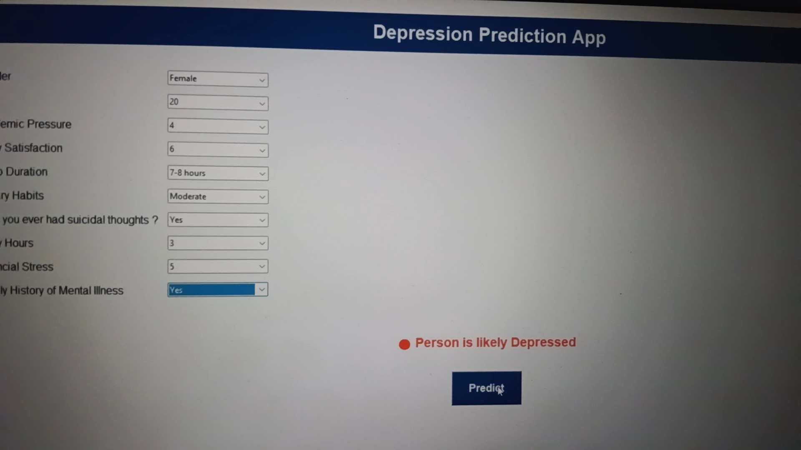

## Depression Predictor  

🔹 A simple Tkinter GUI app that predicts depression likelihood using a Random Forest ML model trained on survey data.  

---

## ✨ Features  
- GUI built with Tkinter (dropdowns & input fields).  
- Handles both categorical and numeric data.  
- Predicts depression likelihood with Random Forest Classifier.  
- Shows results in popup messages (Depressed / Not Depressed).  
- Displays accuracy & classification report in the console.  

---

## 🛠 Technologies Used  
- **Python**  
- **Pandas** – data preprocessing  
- **Scikit-learn** – ML model (Random Forest, LabelEncoder)  
- **Tkinter** – GUI  

---

## 📷 Sample Output  

